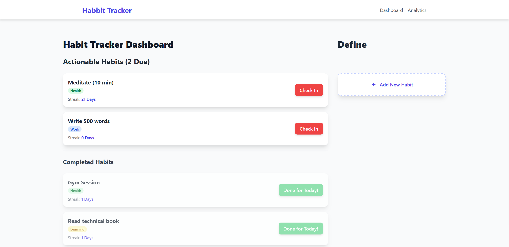

# 🎯 Habit Tracker Dashboard

A modern and responsive **Habit Tracking Application** built using **React** and **Tailwind CSS**, designed to help users define habits, track daily progress, and view streak analytics — all in one unified dashboard.

This project is built as a **single-page application (SPA)**, where the entire logic, UI, and API interaction live inside **Dashboard.jsx**.

---

## ✨ Key Features

- **Habit Definition**  
  Create habits with:
  - Name  
  - Frequency (Daily / Weekly)  
  - Category (Health, Work, Learning, Finance)

- **Daily Check-In**  
  Simple one-click completion for habits due today.

- **Streak Tracking (Mock)**  
  Motivates users with a mock streak count for now (real streak logic can be added later).

- **Real-time API Integration**  
  Works seamlessly with backend REST APIs to:
  - Load habits  
  - Add habits  
  - Mark check-ins  

---

## 🏛️ Architecture Overview

This project uses a **single-file React architecture**, with all components nested inside `Dashboard.jsx`.

### 📁 Component Structure (Inside Dashboard.jsx)

| Component | Description |
|----------|-------------|
| **Dashboard** | Main/root component. Maintains state and handles all API interactions. |
| **AddNewHabit** | Form for creating new habits via `/api/habits` (POST). |
| **HabitCard** | Displays habit details, streak, and provides the daily check-in button. |

All components use React functional components + React Hooks for state management.

---

## 🌐 API Endpoints & Expected Data Structures

The frontend relies on a backend exposing the following REST API routes.

---

### **1. Fetch All Habits**
**Endpoint:** `/api/data`  
**Method:** GET  
**Purpose:** Retrieve all active habits and their current states.

#### Response Example
```json
{
  "habits": [
    {
      "id": "h1",
      "name": "Read 30 mins",
      "category": "Learning",
      "is_due_today": true,
      "mock_current_streak": 5
    }
  ]
}
```
### Create a New Habit — POST `/api/habits`
```json
{
  "name": "Drink Water",
  "frequency": "daily",
  "category": "Health"
}
```
Response:
```json
{ "message": "Habit created successfully" }
```

### Check-in for a Habit — POST `/api/checkin`
```json
{
  "habit_id": "h1"
}
```
Response:
```json
{ "message": "Check-in successful" }
```

---

# 🚀 Getting Started

## 1️⃣ Frontend Setup

### Install Dependencies
```
npm install
```

### Run App
```
npm start
```

---

## 2️⃣ Backend Setup (Python)

### Virtual Environment
```
python3 -m venv .venv
```

### Activate
macOS/Linux:
```
source .venv/bin/activate
```
Windows:
```
.\.venv\ScriptsActivate
```

### Install Requirements
```
pip install -r requirements.txt
```

### Run API
```
python app.py
```


